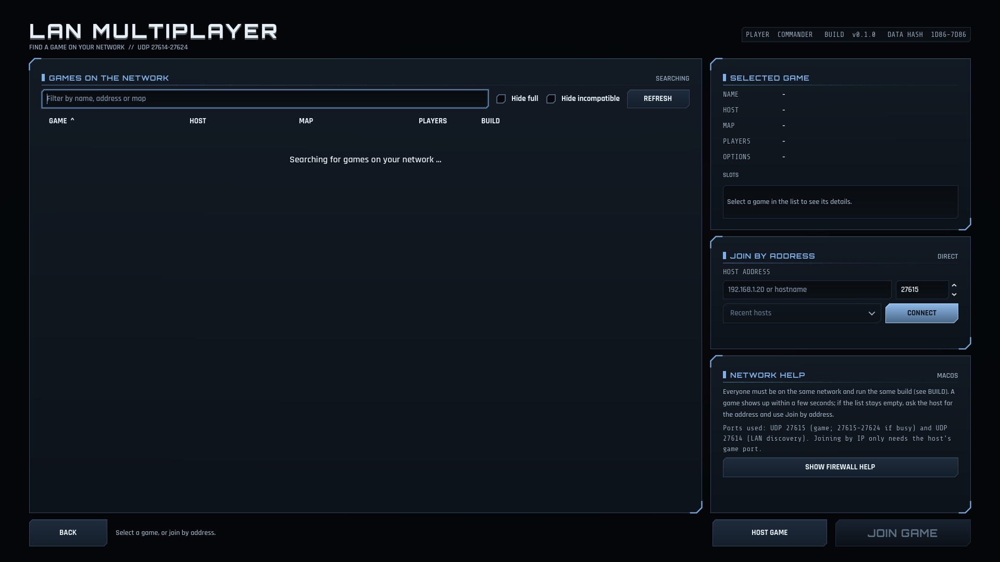
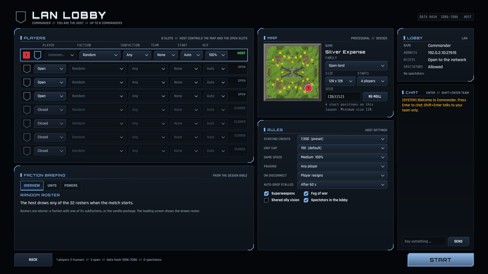

# LAN multiplayer guide

Meridian Fracture plays over a local network with up to **8 players**. The game uses **deterministic lockstep**: every computer runs the complete simulation and only player commands travel over the network (a turn every 100 ms). That means low bandwidth, but it also means that **every computer must run exactly the same build and game data**, and that the game runs at the pace of the slowest connected computer.

There is no internet matchmaking. LAN means one network segment or a VPN that behaves like one.

## Quick start

1. Install the same build on every computer (same version, same OS family is not required: the simulation is verified to be identical on macOS and Linux and is designed to be identical on Windows, but no Windows executable has ever been run, so a Windows computer in the game is untested).
2. **Host:** Main menu > LAN Multiplayer > **Host Game**. Give the game a name, an optional password, keep the port (default 27615), leave "Advertise on the LAN" on, and click **Host game**. You arrive in the lobby as the host.
3. **Join:** Main menu > LAN Multiplayer. The list shows games found on the network (columns GAME, HOST, MAP, PLAYERS, BUILD). Select one and click **Join game**; or type the host's address in **Join by address** and click **Connect**.
4. In the lobby the host configures slots, teams, AI opponents, map and rules (same controls as [skirmish setup](USER_MANUAL.md#skirmish-setup), plus a per-player handicap of 50 % to 200 % that affects income only). Clients pick their own faction, colour and press **Ready**.
5. When every human is ready the host presses **Start**. A short countdown runs, all computers generate the map from the same seed, check that they got the same result and the match begins.

The first time you open the LAN screens the game shows a **network help** dialog explaining the firewall prompt of your system (below). Options > Network > "Show the network help again" reopens it.

## Discovery versus direct address

- **Discovery** works by UDP broadcast: hosts announce themselves once per second, the browser listens and lists games that were announced within the last four seconds. It needs the two computers to be in the same broadcast domain, and "Advertise on the LAN" (Options > Network > LAN discovery) must be on for the host.
- **Direct address** works whenever the joiner can reach the host's game port: `192.168.1.20`, `192.168.1.20:27615`, a hostname, or `[fe80::1]:27615` for IPv6. If you omit the port, 27615 is used. Use this over VPNs, across subnets, or when broadcast is blocked. Recent hosts are remembered in the list.

The host shows its address in the lobby and in the Host dialog. Passwords are per game and are compared by the host; a wrong password is reported as "Wrong password".

## Ports

| Purpose | Protocol / port | Set by |
|---|---|---|
| Game traffic (lockstep, lobby, chat) | **UDP 27615**. If it is busy the game tries the next ports up to **27624** (10 ports) | `NetProtocol.DEFAULT_PORT`, `PORT_SCAN_COUNT`; Options > Network > Port |
| LAN discovery announcements | **UDP 27614** | `NetProtocol.DISCOVERY_PORT` |

Joining by address needs only the host's game port. The game transport is ENet (reliable UDP) with three channels (control, turns, bulk). No TCP is used.

The values come from `game/src/net/net_protocol.gd` (`DEFAULT_PORT`, `DISCOVERY_PORT`, `PORT_SCAN_COUNT`).

## Firewall prompts

The dialog the game shows before the first LAN socket is opened, per platform:

**Windows (Windows Defender Firewall)**

> Windows may ask whether to allow Meridian Fracture through the firewall. Choose Private networks and click Allow.
>
> Missed it? Windows Security > Firewall & network protection > Allow an app through firewall > Meridian Fracture > tick Private.

**macOS (Local Network permission)**

> macOS may ask whether Meridian Fracture can find and connect to devices on your local network. Choose Allow.
>
> Missed it? System Settings > Privacy & Security > Local Network > enable Meridian Fracture.

**Debian and other Linux**

> If you use ufw: `sudo ufw allow 27614:27624/udp`
>
> With nftables or iptables allow inbound UDP 27614-27624 on your LAN interface.

Followed by the line "Ports used: UDP 27615 (game; 27615-27624 if busy) and UDP 27614 (LAN discovery). Joining by IP only needs the host's game port." You can reopen this text at any time with **SHOW FIREWALL HELP** on the LAN screen.

## In the lobby

- The host can change every slot, kick or ban a player, and cancel a started countdown. Clients can un-ready to cancel it.
- Chat works in the lobby and in the match (`Enter` to everybody, `Shift+Enter` to your team; `Esc` closes the box). `J` then a click pings the world or the minimap for your team.
- Spectators can join the lobby if the host allowed them (the lobby lists them), but **watching a running LAN match is not available**: spectators are removed when the match starts. Everyone can watch the recording afterwards (Main menu > Replays); a desync package also contains one.
- During the match `F3` toggles the network overlay (ping and delay per player).

## Troubleshooting

### "Version mismatch" when joining

The host refuses joiners whose build differs. The message names the failing layer:

| Message | Meaning | Fix |
|---|---|---|
| Version mismatch (protocol) | Network protocol version differs | Install the same version everywhere |
| Version mismatch (simulation) | Simulation version differs | Same |
| Version mismatch (game data) | The hash of the loaded game data differs (data files edited or different build) | Same build; remove local data edits |

The main menu shows your **DATA HASH** at the top right (for example `1D86-7D86`) and the LAN screen shows **BUILD** and **DATA HASH**; the two computers must show the same values. Browser rows are marked `OLD` (older build) or `DATA` (different data).

Other join refusals: "The game is full.", "The match has already started.", "The host removed you from this game." (kicked or banned), "Wrong password."

### The game cannot be found in the browser

- Both computers must be on the same network and the host must have "Advertise on the LAN" on.
- Allow the game through the firewall (above). On macOS check the Local Network permission.
- Guest Wi-Fi and some routers block broadcast between devices ("client isolation"). Use **Join by address** with the host's IP.
- Change the port only if you must; the joiner has to type `address:port`.

### The match fails to start ("Different map generated" or "Different starting state")

At launch every computer builds the map and initial state and sends a hash to the host. If they differ the host aborts and the lobby says so, with details in the log. This means the builds are not identical (the version and data-hash check normally catches it earlier). Reinstall the same build everywhere.

Other launch aborts: a player left while loading, loading took too long, or the match settings were corrupted in transit ("Match settings rejected"). The lobby returns and you can try again.

### Desync

Every second (20 ticks) each computer checksums its simulation. If two computers disagree the match stops with **"Desync detected: The game states of the players no longer match"** and the tick where it happened. A diagnostic package is saved on every computer in the user data folder under **`user://desync/`**:

| OS | Folder |
|---|---|
| macOS | `~/Library/Application Support/MeridianFracture/desync/` |
| Windows | `%APPDATA%\MeridianFracture\desync\` |
| Linux | `~/.local/share/MeridianFracture/desync/` |

The dialog has a **Show folder** button. Files are named `desync_<match>_p<player>_t<tick>` with the extensions `.json`, `.state.txt`, `.mfreplay` and `.checks.csv`. Attach all files from all players when reporting a bug. A desync is always a bug in the game, not in your network.

### Stalls and dropped players

Lockstep waits for the slowest player. If a computer stops sending, the others see a banner **"Waiting for <name>... N s"**. After about 8 seconds a **"Player not responding"** prompt appears with three choices per player:

- **Wait** keeps waiting (default).
- **Drop (resigns)** removes the player; their forces are gone.
- **Replace with AI** hands the player's base to an AI.

The host can also set an automatic drop time (Options > Network > "Drop silent players after": Never, 30 s, 1 minute, 2 minutes). If the host itself leaves, the match ends for everyone. A player who disconnects is shown as such in the overlay and the score screen.

### High latency or lag

Options > Network > "Minimum input delay" adds turns of delay to every command (higher is smoother on slow links, at the cost of response). The game raises the delay automatically when the network stalls. The game speed is decided by the host; lower it for slow computers.

## What has and has not been tested

Proven by machine: lobby, launch, lockstep play, fault injection (loss, delay, forced desync) and identical simulation checksums between two real game processes on one computer over 127.0.0.1 (macOS, and Linux amd64 in a container; arm64 in-process), 3,000 ticks with a human, a client and an AI. **Not tested: a game between two physical computers**, a game over Wi-Fi, a VPN or the internet, a Windows host or client, and the firewall prompts of Windows and macOS (the dialog texts are documented, not observed). Please report problems; attach the desync package if the match stops.

## For developers

- Two-process proof on one machine: `python3 tools/py/app_two_process.py` starts a host and a client through the real menus over 127.0.0.1 and compares checksums (reports `APP_TWO_PROCESS RESULT=OK`; about 80 seconds). `python3 tools/py/net_two_process.py` does it at netcode level with fault injection.
- Manual test on one computer: run the game twice with `-- --autostart=lan-host` and `-- --autostart=lan-join=127.0.0.1`.
- Network unit tests: `tools/gd test net_ -q`. Protocol details: `tools/spec show net 5`.
