# Meridian Fracture: user manual

Meridian Fracture is a real-time strategy game in the tradition of Command & Conquer: you build a base, harvest credits, produce an army and destroy every enemy structure. Eight factions, 32 rosters, procedurally generated maps, a tutorial and eight campaign operations, skirmish against computer opponents, LAN multiplayer and replays of every match.

**Honest status.** The numbers were tuned by AI-versus-AI play (no human has playtested the balance), the audio was generated and checked by measurement but never listened to by a person, the Windows build was never run on a Windows computer, and LAN play was proven between processes, not between two real machines. See [INDEX.md](INDEX.md) and [KNOWN_ISSUES.md](KNOWN_ISSUES.md). Every keyboard shortcut the game lists is connected (section 14, [CONTROLS.md](CONTROLS.md)); a few Options rows still do nothing, see KNOWN_ISSUES section 2.

Exact values for every unit and structure are in the generated reference [units/README.md](units/README.md); in the game the **Field Manual** (F1) shows the same data. Other documents: [CONTROLS.md](CONTROLS.md) (every key and mouse action), [LAN_GUIDE.md](LAN_GUIDE.md), [FACTIONS.md](FACTIONS.md).

## 1. Starting a game

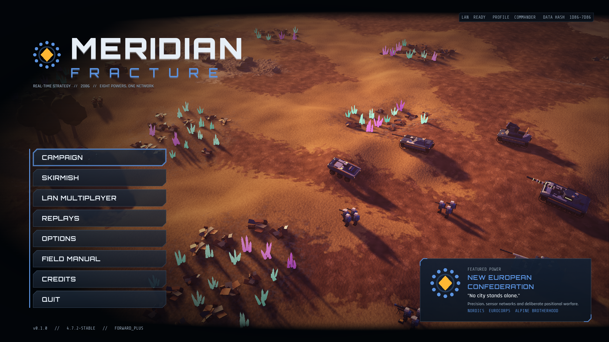

**Main menu:** Campaign, Skirmish, LAN Multiplayer, Replays, Options, Field Manual, Credits, Quit. The panel at the bottom right shows a featured faction; the top right shows your network readiness, profile name and the **data hash** (two players must show the same hash to play together).

### Skirmish setup

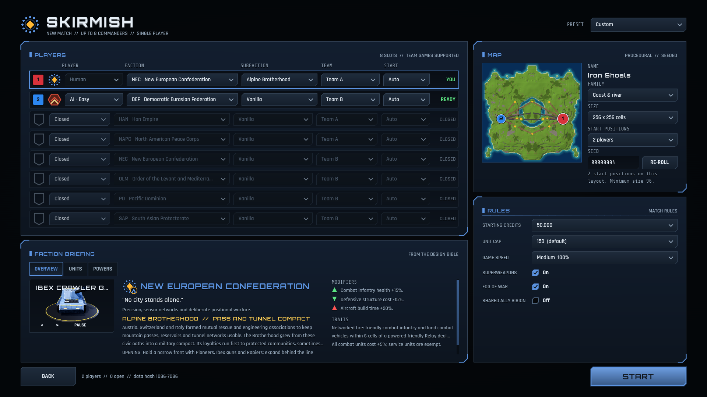

The lobby has up to **8 slots**. For each slot choose:

- **Kind:** Human (the first slot), AI (Easy, Medium, Hard, Brutal), Open or Closed (LAN only).
- **Faction and subfaction:** any of the 8 factions with its vanilla roster, one of its three subfactions, "any of the four", or Random. See [FACTIONS.md](FACTIONS.md). The briefing under the slot table has Overview, Units and Powers tabs; the Units tab shows a rotating **3D model** of every unit (drag to turn, `<` `>` to browse).
- **Team:** None or Team A to D. Players on the same team share victory; you cannot start with everyone on one team.
- **Colour** and **start position** (automatic by default). Two players may not share a colour or a start.

Map and rules:

| Setting | Values |
|---|---|
| Map family | Open land, Urban routes, Coast and river |
| Map size | 96, 128, 160, 192, 224, 256 cells (the layout is symmetric for 2, 4, 6 or 8 players; 3 to 4 players need 128, 5 to 6 need 160, 7 to 8 need 192) |
| Seed | Any number: the same seed and settings always generate the same map on every computer; **Re-roll** picks a new one. The preview shows the start positions |
| Starting credits | 2,500 / 5,000 / **7,500** / 10,000 / 15,000 / 20,000 / 50,000 |
| Unit cap | 50 / 100 / **150** / 200 / 300 / 500 (per player, non-structure units; Collectors, MCVs, summons and decoys are exempt) |
| Game speed | 50 %, 75 %, **100 %**, 125 %, 150 %, 200 % |
| Superweapons | On or off |
| Fog of war | On or off |
| Shared ally vision | On or off |

Presets (1v1 vs Medium AI, 2v2 vs Medium AI, 3-AI free-for-all, 4v4 vs Hard AI on a coast map) fill the slots for you. Your last setup is remembered. **Start** is enabled when the setup is valid; otherwise the lobby names the problem ("Add at least one opponent", "Two players share a colour", and so on).

A match starts with a deployed **Headquarters** and the starting credits.

### Winning and losing

A player is eliminated when they own no structures and no Mobile Construction Vehicle. A team wins when every opposing player is eliminated (or has resigned or disconnected). Surrender is in the Esc menu (you then watch the rest as an observer). The end screen has **Summary**, **Military**, **Economy** and **Graphs** tabs, and the buttons **Save replay**, **Watch replay**, **Play again** and **Main menu**.

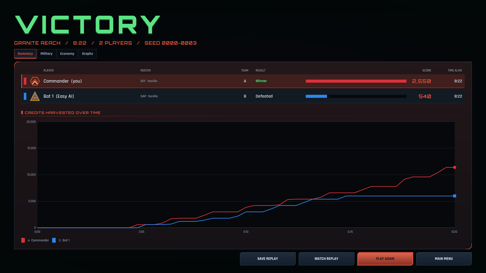

### Game speeds

The simulation always runs at 20 ticks per second at 100 %; the speed setting scales the pace of the whole match (in LAN games the host chooses it). Pause (`Pause` or `Ctrl+P`) freezes a single-player match; in LAN games pausing follows the host's rule (any player, host only, or off). Opening the Esc menu pauses a single-player match unless you turn that off in Options > Controls.

## 2. The screen

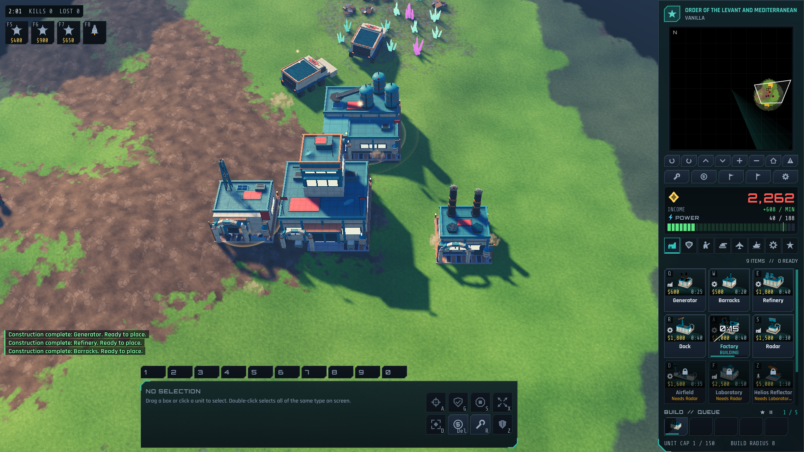

- **Top left:** match clock, kills and losses, and the **support power dock** (three powers and the superweapon, with prices, cooldown sweeps and their keys `F5` to `F7` and `F8`; click the icon or press the key).
- **Sidebar (right):** faction badge, the **minimap** with a camera pad, **credits** and income per minute, the **power bar**, the **build tabs** (structures, defenses, infantry, vehicles, aircraft, ships, research, powers), the **build cards** and the **queue strip** underneath. The footer shows unit cap use and the build radius (8). Cards show READY, BUILDING, NEED CREDITS or what they need ("Needs Radar").
- **Bottom:** control-group bar (1 to 0), the selection panel (portrait, health, abilities) and the **command bar** (attack-move, guard, stop, scatter, deploy, sell, repair, stance).
- **Alerts** appear as toasts, as edge markers and on the minimap. Click the minimap to look, or press `Space` to jump the camera to the latest alert.
- **Units and teams.** Every unit and structure carries a plate in its owner's colour (checked for contrast for all 32 rosters and 8 colours); subfaction rosters wear their own livery (a flank panel on vehicles and ships, wing-tip flashes on aircraft). Infantry and vehicles are drawn slightly larger than their simulation size so they read next to structures.

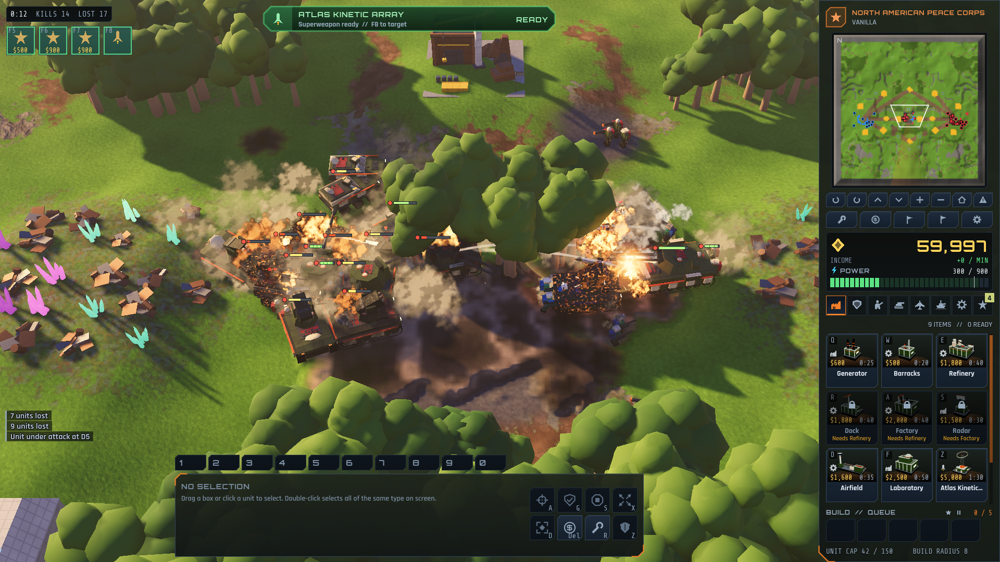

## 3. Economy

### Credits

Credits are the only currency. **Collectors** harvest salvage deposits (glowing crystal fields on the map) and drive them to a **Refinery**, carrying up to **600 credits** (exactly one deposit cell) per trip. At the Refinery a Collector reverses into the bay, sinks out of sight while it unloads and drives out again; **one Collector unloads at a time**, so a long queue at one Refinery wastes time (about three Collectors per Refinery is the sweet spot). Every Refinery comes with one free Collector; more can be bought from the Refinery. Collectors work automatically: when built they pick the nearest field. To send one elsewhere, right click a deposit; to send it home, right click a Refinery.

Deposits are **finite and do not regrow**: a standard field holds 14,400 credits (24 cells), a rich field 19,200 (16 cells of double value). Each start position has starter fields nearby; richer, more contested fields lie between bases. When the near fields run dry you must expand, which needs a Mobile Construction Vehicle. You cannot build on a deposit. Some maps also contain neutral **Salvage Depots** that pay credits to the player who holds them (section 8).

### Progressive payment

Production and construction are **paid while they progress**, not up front. If your credits reach zero, the item pauses (the card says NEED CREDITS) and resumes when you can pay again. Cancelling refunds exactly what has been paid so far. Selling a structure refunds half of its price.

### Power

Structures draw power and each **Generator** supplies +150 (Olm generators supply more). If demand exceeds supply the base is in **low power**:

- unit production, construction and research run at 50 % speed,
- powered defenses, Relays, Radar and Laboratory powers stop working,
- superweapon recharge pauses.

Units already built and completed research keep working. The power bar in the sidebar shows supply and demand; a banner warns when you fall short. The South Asian Protectorate keeps its defenses running for 20 seconds after a shortage begins (a reserve that recharges after 60 seconds of adequate power).

### Building structures

1. Pick a card in the structure tab. It builds in the **one player-wide construction queue** (five slots); one item progresses at a time.
2. When it is complete the card says READY. Click it, move the placement ghost (green is valid, red is blocked) and click to place.
3. Structures must stand within the **build radius of 8 cells** of a friendly Headquarters (shown as a ring while placing). A Relay does not extend it. To expand, build a **Mobile Construction Vehicle** (Factory, needs Radar) and deploy it (`D`) where you want a second Headquarters.
4. Refineries, Barracks, Factories and Airfields need their **apron** (exit area) clear, Docks need a shoreline with enough open water, and only one superweapon launcher per player is allowed.

Structures have a build-up phase after placement and show damage stages and rubble. A **Repair** (`R`) click toggles repair on a damaged structure: it heals about 1 % of its health per second and costs 0.5 % of its price per second. **Sell** (`Delete`) removes it for half its price.

### Production and research queues

Each Barracks, Factory, Airfield and Dock has its own **queue of five**. The first producer of each kind is the **primary** building; new units appear there and walk to the **rally point** (`F` tool). Left click a unit card queues one, right click removes one. Producing costs 1 unit-cap slot per unit; at the cap, production pauses.

**Research** has a single player-wide queue in the research tab. Upgrades take 45 seconds at tier 2 and 75 seconds at tier 3, and stay after the building that unlocked them is lost.

### Tech tiers

| Tier | Requires | Gives access to |
|---|---|---|
| T1 | The producing structure (Barracks, Factory, Dock, Airfield) | Basic infantry, light vehicles and tanks, patrol boats |
| T2 | plus **Radar** | Advanced units, anti-air, artillery, frigates, T2 research and powers, MCV |
| T3 | plus Radar **and Laboratory** | Heavy tanks, gunships and bombers, capital ships, T3 research, powers and the **superweapon** |

The structure chain is Headquarters, Generator, then Refinery and Barracks, Factory and Dock (after Refinery), Radar (after Factory), Airfield and AA battery (after Radar), Laboratory (after Radar). Watchtower needs a Barracks and the Anti-tank turret needs a Factory. Cards you cannot yet build show what they need ("Needs Radar").

**Losing a prerequisite** (for example your Radar) pauses dependent unfinished items in place; they resume when you rebuild it. Finished units and completed research stay.

### Shared structures

| Structure | Cost | Power | Purpose |
|---|---:|---:|---|
| Headquarters | free | 0 | Build radius centre, tech root. If you lose all of them and every MCV, you are out |
| Generator | 600 | +150 | Power |
| Refinery | 1,800 | -30 | Credits drop-off, Collector production |
| Barracks | 500 | -10 | Infantry |
| Factory | 2,000 | -40 | Vehicles, MCV |
| Dock | 1,800 | -35 | Ships, Landing Transport (needs shore) |
| Radar | 1,500 | -40 | Tier 2, sight range 14, powers |
| Airfield | 1,600 | -40 | Aircraft; provides rearm pads |
| Laboratory | 2,500 | -60 | Tier 3, powers |
| Watchtower | 450 | -5 | Cheap tower, detects camouflaged units within 4 cells |
| Anti-tank turret | 800 | -15 | Defense against vehicles |
| AA battery | 900 | -20 | Anti-air, detects within 5 cells |

Each faction adds unique structures (advanced defenses, Relay, its superweapon launcher); see the Field Manual.

## 4. Units, roles and counters

Units come in three broad layers: ground (infantry squads, vehicles), air and water. **Infantry are squads**: one selectable entity, one health pool; the individual soldiers fall as health drops. Service units are shared by everyone: Engineer (500), Collector (1,400), Mobile Construction Vehicle (3,000) and Landing Transport (900, carries four squads or two vehicles across water).

### Damage matrix

Combat is a lookup: **weapon damage x (damage type against armor class) x (1 - resistances)**, resistances capped at 50 %. The armor classes are infantry, light vehicle, medium armor, heavy armor, light and heavy aircraft, light and heavy ships, light and heavy buildings and fortress (Headquarters and superweapon launchers). The percentage of a weapon's damage that reaches each armor class (from `game/data/balance/global.json`):

| Damage type | Infantry | Light veh. | Medium | Heavy | Air light | Air heavy | Bldg light | Bldg heavy | Fortress |
|---|---:|---:|---:|---:|---:|---:|---:|---:|---:|
| Bullet (rifles, MGs, autocannon) | 100 | 55 | 30 | 15 | 65 | 25 | 25 | 12 | 6 |
| Armor-piercing (cannons, AT and AA missiles, torpedoes) | 40 | 100 | 100 | 90 | 100 | 85 | 65 | 60 | 40 |
| High explosive (artillery, bombs, flak) | 100 | 85 | 65 | 50 | 60 | 45 | 110 | 100 | 70 |
| Thermal (beams) | 55 | 100 | 100 | 90 | 95 | 65 | 100 | 100 | 80 |
| Rail | 20 | 100 | 115 | 125 | 0 | 0 | 60 | 65 | 55 |
| Kinetic (strategic) | 40 | 70 | 100 | 130 | 0 | 0 | 130 | 130 | 100 |

The full matrix (including ships) is in [balance/TAXONOMY.md](balance/TAXONOMY.md). EMP is non-lethal: it disables and never takes health below 1.

### Roles

| Role | Good against | Weak against |
|---|---|---|
| Line infantry (rifle squads) | Infantry, light vehicles, aircraft (small arms can hit air) | Artillery, HE, armored vehicles |
| Anti-tank infantry (missile teams) | Vehicles, tanks | Infantry, anything that reaches them |
| Light vehicles and scouts | Scouting, harassment, carrying squads | Everything armed |
| Main battle tanks | Vehicles, structures (armor-piercing) | Massed anti-tank, rail, air |
| Heavy tanks and walkers | Everything on the ground; soak bullets | Rail, kinetic, bombers, cost |
| Anti-air vehicles | Aircraft | Ground assaults |
| Artillery | Structures, infantry blobs (high explosive, long range) | Fast raids, counter-battery, being caught alone |
| Fighters and gunships | Vehicles, artillery, collectors | Anti-air, fighters |
| Bombers | Structures | Interceptors, AA |
| Ships and submarines | Coastal targets, other ships | Air, shore defenses; submarines are hidden unless detected |
| Support (medics, engineers, repair) | Sustaining the army | Everything |

Counter thinking: bullets barely scratch heavy armor and structures; explosive shells are the anti-structure and anti-infantry tool; rail and kinetic punish heavy armor; nothing but dedicated AA (and small arms) hits aircraft.

A taste of three rosters (Field Manual or [units/README.md](units/README.md) for all): row by row, infantry and light vehicles first, then artillery and air, ships last.

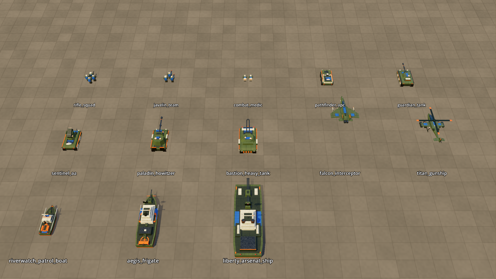
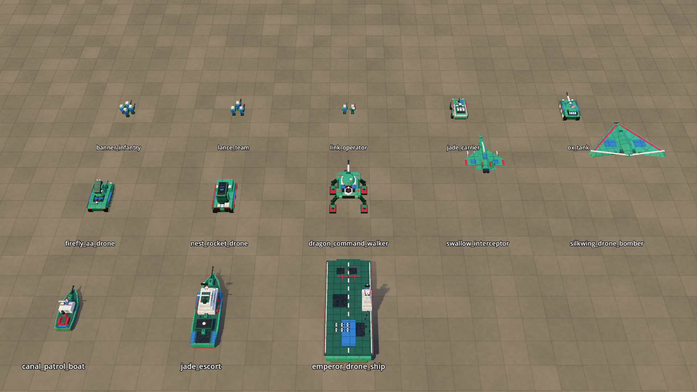
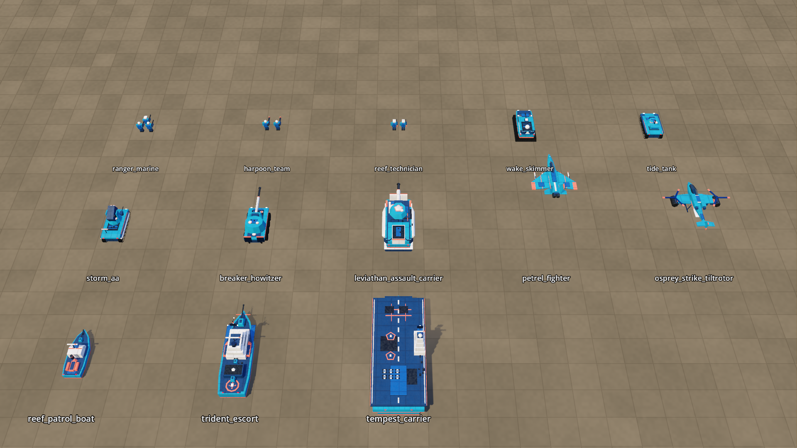

### Fog, stealth and detection

The map starts in **shroud** (unexplored). Explored but currently unseen ground is in **fog**: you see the terrain and remembered structures (as ghosts) but not units. Units and structures have **sight ranges**: infantry 7, tanks 9, scouts 12, Headquarters 11, Radar 14 cells.

**Camouflaged** units are invisible to enemies until an enemy detector comes within **5 cells** (Watchtower 4, AA battery 5; detector vehicles and escorts have their own radius). Firing, taking damage, or leaving the ability's movement restriction reveals them. Submarines are hidden the same way.

Unarmed **Engineers** capture neutral structures and repair land vehicles and structures (about 1 % of maximum health per second, costing 0.5 % of the target's price per second). **Salvage**: African Empire units can recover wrecks for credits (20 % of the destroyed unit's price).

## 5. Support powers and superweapons

Each roster has **three support powers**: two shared by all rosters of the faction and one that is either vanilla-only or specific to the subfaction. Powers cost credits per use (about 400 to 900) and have cooldowns of their own; they are ready when first unlocked and a rebuilt prerequisite never resets a cooldown. **Tier 2 powers** need a powered Radar; **Tier 3 powers** need a powered Radar and Laboratory. Click the power icon in the dock or press `F5` to `F7`; most powers then ask you to click a target (line and corridor powers: press on the start and drag for the direction, release to fire; or click the start, move the pointer, click again). A target-less power fires at once. A power that is not ready, or that you cannot afford, says why instead of starting. A target generally needs current vision unless the power is reconnaissance.

### Superweapons

Each faction has one strategic launcher (dock icon on the right, key `F8`). It needs Radar, Laboratory and the launcher structure (5,000 credits, 90 s build, 200 power), **starts empty** and charges only while you have power. You can store **one charge**. `F8` (or the icon) starts the targeting; the preview turns red and hatches your own units when the strike would hit them. Selecting the target starts a **warning**: everyone affected sees a marked zone with a countdown, which cannot be hidden by fog or decoys. Destroying (or EMP-disabling) the launcher during the warning cancels the attack without refunding the charge. An ordinary power shortage after activation does not cancel it. Superweapons can be switched off in the lobby.

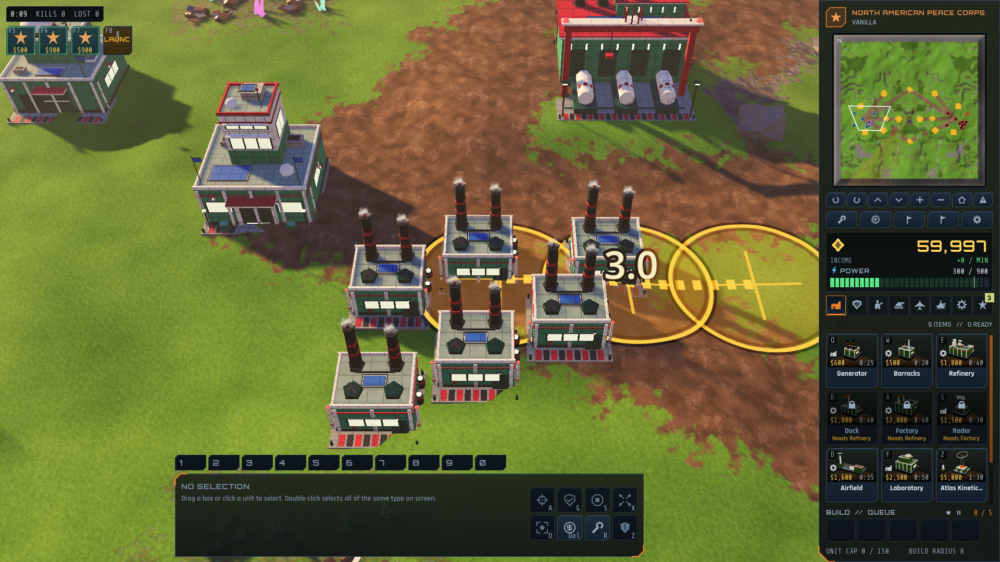
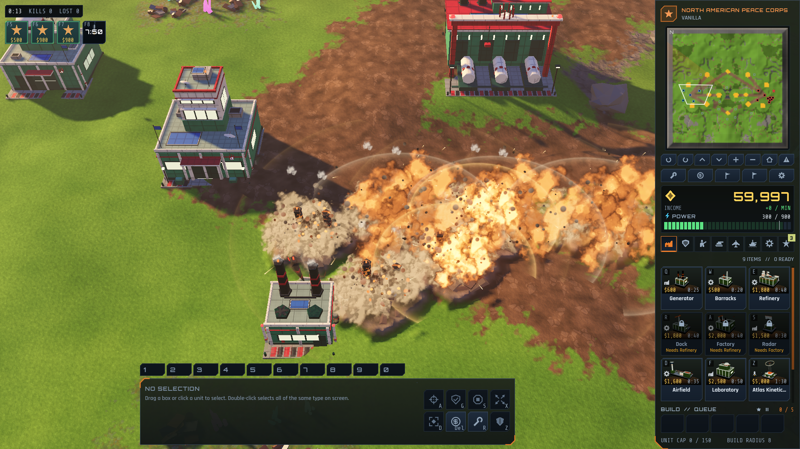

(Both pictures come from the debug showcase scenario, which builds the launcher instantly; in a real match the first strike is rare before minute 20.)

| Faction | Superweapon | Recharge | Warning | Effect |
|---|---|---:|---:|---|
| NAPC | Atlas Kinetic Array | 480 s | 10 s | Three guided kinetic penetrators in a row, 2-cell radius each |
| NEC | Aurora Microwave Array | 420 s | 8 s | 8-cell burst: enemy vehicles and aircraft lose weapons for 8 s, powered structures shut down for 18 s |
| OLM | Helios Reflector | 480 s | 10 s | 16 x 3 cell line swept by a thermal beam over 12 s |
| DEF | Perun Missile Complex | 480 s | 10 s | Bunker-buster core (3 cells) plus a fragmentation ring out to 7 cells |
| PD | Tempest Swarm Hub | 480 s | 10 s | 24 strike drones attack a 6-cell area for up to 20 s; AA can shoot them down |
| HAN | Dragonfall Field Foundry | 480 s | 10 s | Three capsules unfold into siege engines that fight for 60 s |
| AE | Horizon Mass Driver | 480 s | 10 s | Three overlapping impacts along a 10-cell line; debris slows vehicles and blocks building |
| SAP | Trident Interception Array | 360 s | 6 s | Defensive: a 6-cell zone destroys incoming missiles and shells for 25 s |

Counterplay is part of the design: spread out valuable units and buildings, move units out of the marked zones during the warning, and hunt the launcher.

## 6. Factions

Eight factions with a vanilla roster and three subfactions each (details, lore and rosters in [FACTIONS.md](FACTIONS.md); every unit in [units/](units/README.md)):

| Faction | Doctrine | Stats |
|---|---|---|
| North American Peace Corps | Durable combined arms; reliable frontline vehicles and recovery | [napc](units/napc.md) |
| New European Confederation | Precision, sensor networks and deliberate positional warfare | [nec](units/nec.md) |
| Order of the Levant and Mediterranean | Mobile combined arms, concealment and abundant electrical power | [olm](units/olm.md) |
| Democratic Eurasian Federation | Industrial volume, artillery saturation and replaceable armored forces | [def](units/def.md) |
| Pacific Dominion | Amphibious maneuver, naval reach and flexible coastal logistics | [pd](units/pd.md) |
| Han Empire | Affordable infantry, unmanned support and vulnerable command links | [han](units/han.md) |
| African Empire | Recovery, battlefield salvage and practical industrial endurance | [ae](units/ae.md) |
| South Asian Protectorate | Protected advances, resilient defenses and battlefield engineering | [sap](units/sap.md) |

A **subfaction** replaces one or two units of its parent, adds one modifier (for example "aircraft cost -15 %") and one exclusive research or power. Rules always stack in the order faction, subfaction, research and temporary effects, and never below the floors: cost and build time not under 60 % of base, reload not under 50 %, total damage resistance not over 50 %.

## 7. Maps

Maps are **generated from a seed** and are deterministic across Windows, macOS and Linux. There are three families: open land with terraces, urban routes with street grids and civilian blocks, and coast and river maps with water, marsh and bays. Every start has at least two exits, starter deposits nearby, and a baseline economy that never needs water. Layouts are symmetric for 2, 4, 6 or 8 players. The look of the battlefield (lighting and colour grading) follows the seed: temperate day, arid dusk, arctic day, tropical day, or urban night; Options > Graphics > Environment look can force one.

## 8. Neutral structures

Engineers capture neutral structures (the capture speeds up with up to three Engineers; they are not consumed; an enemy Engineer can contest or burn down your progress):

| Structure | While owned |
|---|---|
| Grid Substation | +100 power |
| Salvage Depot | +50 credits every 10 seconds |
| Field Hospital | Infantry within 5 cells recover 2 % health per second |
| Observation Tower | Sight range of 14 cells |
| Harbor Terminal | Lets you produce tier-1 ships from it |
| Civilian Block (urban maps) | Cannot be captured; holds four infantry squads that fire out |

Enemy production structures and superweapon launchers cannot be captured.

## 9. AI opponents

| Level | Behaviour |
|---|---|
| Easy | Slow, no expansions, first attack after about 15 minutes, no dodging, basic powers, unit cap 60 % |
| Medium | Scouts, one expansion, first attack after about 10 minutes, dodges artillery half the time, uses powers, unit cap 85 % |
| Hard | Two expansions, first attack after about 7 minutes, always dodges, uses powers and superweapons well |
| Brutal | Three expansions, first attack after about 5.5 minutes, best micro. **Cheats and says so:** +20 % credits and income, and it sees through fog |

Every AI plays by the same rules (build radius, power, tier, cap) and issues ordinary commands, apart from Brutal's labelled cheats. What to expect from the current AI (it was made much more decisive in the last balance rounds):

- **Economy first.** Medium and above field seven to ten Collectors, expand early with a Mobile Construction Vehicle (second Refinery, Factory and Collectors), and rebuild lost Collectors before spending on defenses. Expect to be out-harvested if you stay on your start fields.
- **Few static defenses.** Medium and above build far fewer towers than Easy; they put the money into army and expansion. In AI-versus-AI tests about one Medium-versus-Medium match in three ended by elimination within 20 minutes, and a Hard AI beat an Easy one by elimination in 30 of 32 matches.
- **Waves with a plan.** Armies gather at a staging point between the bases, attack in waves (Hard and Brutal can split a big wave into prongs), retreat when losses mount, and keep pressing while your structures are falling. Hard and Brutal always dodge marked zones and kite.
- **Scouting, harassment, powers.** Medium and above send harassment squads; support powers are used on clustered targets; superweapons are built when the AI is ahead or has time (the first strike usually comes after minute 20).
- **Doctrine per roster.** Each of the 32 rosters has its own opening and dials (for example how much it expands, harasses or defends), so the same difficulty plays differently with different factions.
- **Weak spots.** The early game is army-light (in tests about three units at 4:30, so a determined rush can punish it), and an AI with an empty bank and no Collectors cannot recover.

The AI was balanced against itself: across a 1,140-match round robin of Hard AIs every roster won between 35 % and 65 %. That says nothing about how a human plays each faction.

## 10. Campaign and tutorial

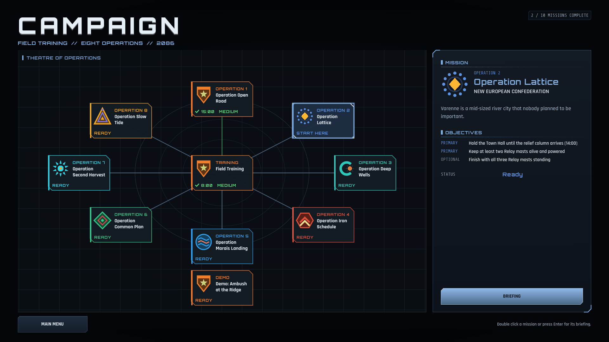

**Main menu > Campaign** opens the theatre map: the tutorial **Field Training** in the middle, the eight faction **Operations** on a ring around it, and a short **Demo** mission along the bottom. Each card shows the faction emblem, the state (READY, a green tick once completed, locked) and your best winning time and the highest difficulty you beat. The operations unlock once you have completed the tutorial or any operation; after that all eight are open in any order. Select a card to read its teaser and objectives; **Briefing** (or a double click, or Enter) opens the briefing.

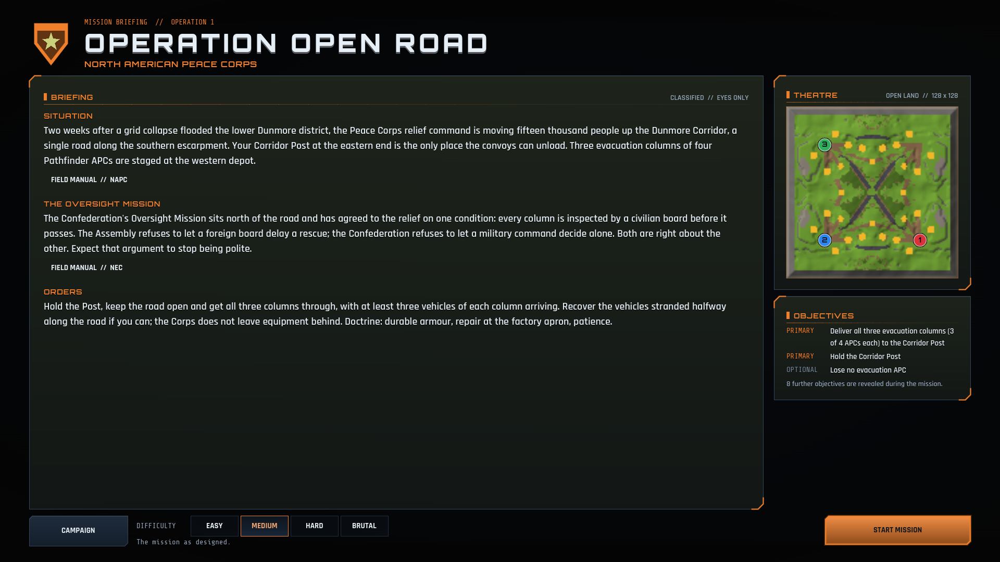

The **briefing** gives the situation and orders, links into the Field Manual for the factions involved, a map preview with every start marked, the objectives (hidden ones are not revealed) and the **difficulty**: Easy, Medium ("the mission as designed"), Hard, Brutal. The difficulty shifts the level of every AI player by one step per notch (Easy minus one, Hard plus one, Brutal plus two). **Start mission** loads the map.

| Mission | Faction | Setting | Main task |
|---|---|---|---|
| Field Training | NAPC | open 128 | 21 guided steps: camera, selecting, attack-move, force fire, building, training, rally points, control groups, turrets, Radar, a support power, repairing and selling, a final defense and a superweapon drill against a rival launcher |
| Operation Open Road | NAPC | open 128 | Escort three evacuation convoys of four APCs to the Corridor Post and hold it; recover the stranded vehicles |
| Operation Lattice | NEC | urban 128 | Hold the Town Hall for 14 minutes with at least two Relay masts alive and powered |
| Operation Deep Wells | OLM | open 128 | Keep two of three well pumps running for 13 minutes; strike the Authority's forward depot |
| Operation Iron Schedule | DEF | open 128 | Destroy the control post at Junction One and the others; drone swarms and a grain depot dilemma |
| Operation Marais Landing | PD | coast 128 | Land from the sea, clear the port and take the quays; keep the beachhead standing |
| Operation Common Plan | HAN | open 128 | Raise three relay nodes with an operator at each site while the raiders are repelled |
| Operation Second Harvest | AE | open 128 | Rebuild the Works, field 14 combat units and hold until the convoy arrives |
| Operation Slow Tide | SAP | coast 128 | Advance in order, line by line, behind your defenses, and do not lose the base |
| Demo: Ambush at the Ridge | NAPC | open 96 | A small ambush scenario for a first look |

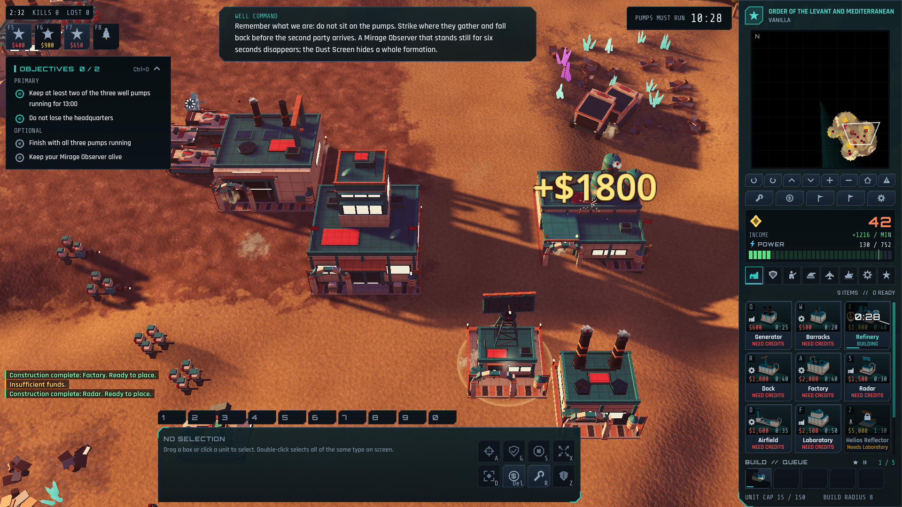

In a mission the screen is the normal one plus a **mission layer**: the **objectives panel** at the top left (primary, secondary and optional objectives with their state; it flashes when something changes and folds with `Ctrl+O`), **message plates** with the speaker's text (some also with an announcer line), a **timer** chip at the top (for example "PUMPS MUST RUN 10:28") and ribbons for new, completed and failed objectives. Hidden objectives appear when the story reveals them. Missions have their own rules (credits, fog, who is eliminated); the script decides when you win or lose, not the usual "no structures left" rule.

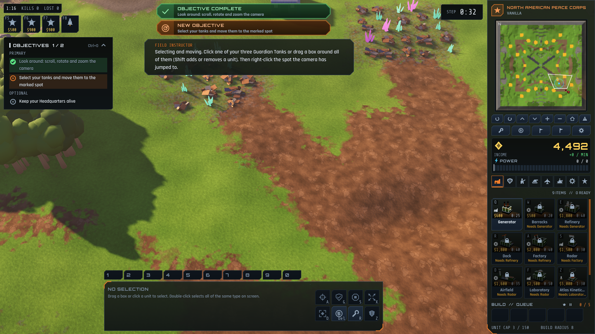

At the end the **result screen** lists every objective (completed, failed or not completed) and a debrief (mission time, difficulty, enemy units and structures destroyed, your losses, credits harvested and spent). Buttons: **Next mission** after a win, **Retry** after a defeat, **Watch replay**, **Campaign**. Progress (completed, best time, best difficulty, attempts) is saved in `campaign.cfg` in the user data folder; a missing or damaged file just starts fresh.

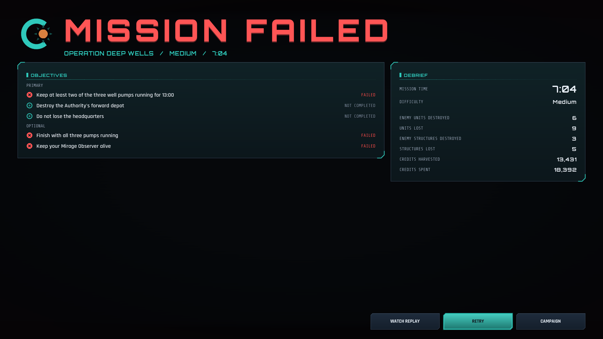

The tutorial names keys (`F5` for the UAV sweep, `Y` or `Ctrl`/`Option` + right click for force fire, `Space` for the last alert); all of them work, and so do the mouse alternatives (click the power icon). Each step has a timeout after which the game helps (spawns what you need).

## 11. Replays and the observer view

Every match you play is **recorded automatically** (the last three are kept as `autosave_N` files; change the number in Options > Network > replay autosave, 1 to 10; crash recordings are kept too). A replay stores the commands only, so playing it back re-simulates the match exactly; a replay recorded with a different balance version warns that it may diverge.

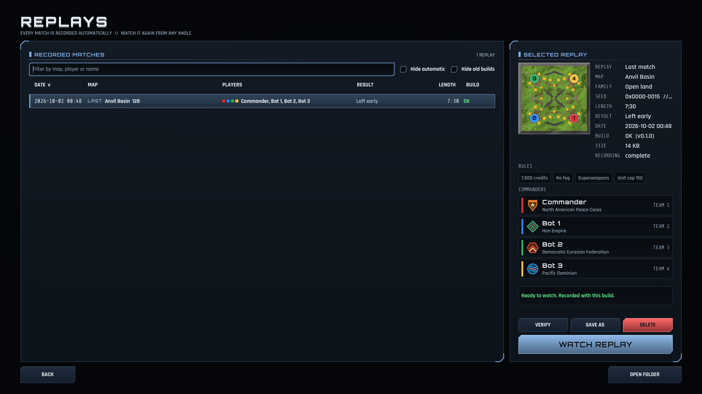

**Main menu > Replays** lists the recordings: date, map, players, result, length and the build that recorded them. Filter by map, player or name, hide automatic recordings or old builds. The right panel shows the map preview, rules and every commander. **Watch replay** plays it; **Verify** replays it quickly in the background and compares the recorded checks; **Save as** keeps a copy under a name; **Delete**; **Open folder**. From the end screen use **Save replay** or **Watch replay**.

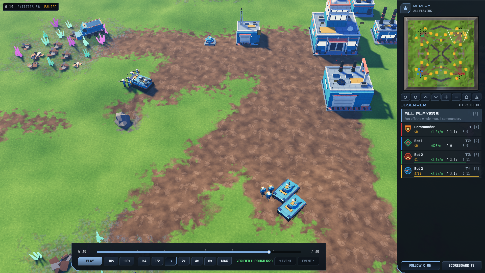

While watching you get the **observer HUD** instead of the sidebar: a minimap, the list of commanders (credits, income per minute, army value `A` and structure count `S`; click one to view from that player), and a **replay bar** at the bottom with Play/Pause, -10 s and +10 s, speeds 1/4, 1/2, 1x, 2x, 4x, 8x and MAX, previous and next **event** buttons, a seek slider (dragging back rebuilds the world up to that tick) and the badge "Verified through mm:ss" that tells you how much of the replay has been checked against the recorded checksums. **All players** shows the whole map with fog off; choosing one commander shows what that player could see (`1` to `8`, `Tab` for the next, `0` for all, `F` toggles fog). **Follow** (`C`) keeps the camera on the action until you move it yourself. `F2` opens the **scoreboard** (credits, income, units, buildings, kills, losses, score, actions per minute). The same view appears when you surrender, are defeated, or run a match with no human player. Esc opens a replay menu (Resume, Options, Field Manual, Leave replay).

Watching a *running* LAN match as a spectator is not available: spectators can sit in the lobby but are removed when the match starts. Use the replay afterwards.

## 12. The Field Manual

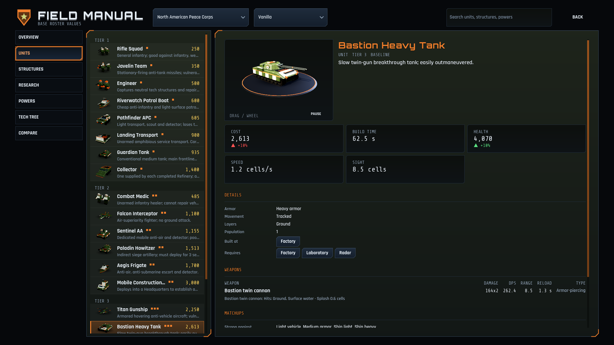

Press `F1` in a match or open it from the main menu. Pick a faction and roster at the top and browse **Overview** (lore, traits, opening, counterplay), **Units**, **Structures**, **Research**, **Powers**, the **Tech tree** graph and a **Compare** tab. Search finds units, structures and powers by name. Values are base values before roster modifiers (a modifier shows as a coloured delta, for example +10 % cost). In the unit and structure detail view the **model viewer** shows the real 3D model on a turntable in the roster's livery: drag to rotate, mouse wheel to zoom, double click to reset, **Pause** to stop the idle animation. The weapons list shows damage, DPS, range, reload and damage type, and the matchups list says which armor classes the unit is strong or weak against.

## 13. Options

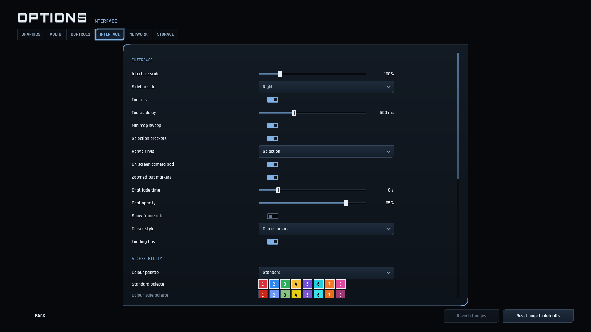

| Page | Contents |
|---|---|
| Graphics | Adapter, window mode, resolution, V-Sync, FPS cap, quality preset (Auto, Low, Medium, High, Ultra) with an advanced foldout (render scale, anti-aliasing, shadows, SSAO, glow, decor density, health bars, outlines, unit renderer, night maps, wide camera view), **Environment look**, renderer (Forward+, Mobile, Compatibility); some changes need a restart or ask you to keep or revert within 15 seconds |
| Audio | Master, music, effects, ambience, interface and voice volumes; announcer and unit voices; music mode; captions; dynamic range; output device; mute when unfocused |
| Controls | Key bindings (filterable, per-action reset, conflict warning), double-click and drag thresholds, sticky order modes, group double-tap centring, Esc clears selection, pause on menu or focus loss |
| Interface | UI scale, sidebar side, tooltips, minimap sweep, range rings, on-screen camera pad, strategic markers, chat fade, FPS counter, cursor style, tips; accessibility (colour-blind palette, high-contrast HUD, reduce motion and flashes, UI font, announcer text-to-speech, cursor scale); camera speeds, inversion, orbit mode, edge scrolling; language |
| Network | Player name, port, LAN discovery, minimum input delay, drop-after time, replay autosave count, chat recording, network overlay, network help |
| Storage | Disk use of replays, screenshots, logs, crash reports, caches, with buttons to open the folders and clear caches |

Settings are stored in the user data folder (macOS `~/Library/Application Support/MeridianFracture/`, Windows `%APPDATA%\MeridianFracture\`, Linux `~/.local/share/MeridianFracture/`).

## 14. Hotkeys that matter

The complete, generated list is [CONTROLS.md](CONTROLS.md); every key can be rebound in Options > Controls. All of these are connected:

| Keys | Action |
|---|---|
| Left click / drag, `Shift` | Select, box select, add to selection; double click = all of that type on screen |
| Right click, `Shift` + right click | Context order (move, attack, harvest, capture, load, repair, rally ...), queued with Shift |
| `Ctrl` + right click (`Option` on macOS) | Force fire |
| `A`, `G`, `P`, `Ctrl+F` | Attack-move, guard, patrol, follow (arm the mode, then click) |
| `S`, `X`, `H`, `D`, `Z`, `V`, `U` | Stop, scatter, hold, deploy, stance, return to base, unload |
| `R`, `Delete`, `F`, `W` | Repair tool, sell tool, rally point, waypoint mode |
| `Ctrl+A`, `Ctrl+Shift+A`, `N`, `Shift+N`, `C`, `B`, `Ctrl+Home` | All combat units, those on screen, next / previous idle unit, next Collector, next producer, Headquarters |
| `Ctrl+1` ... `0`, `1` ... `0` | Assign and recall control groups (twice = centre the camera); `Shift+n` adds a group |
| Arrows, `Q` `E`, `PageUp` `PageDown`, `+` `-`, `Home`, `.`, `Backspace`, `F9`-`F12` | Pan, rotate, tilt, zoom, centre on base, centre on selection, reset camera, camera bookmarks (`Ctrl+F9`-`F12` set) |
| `F1`, `F3`, `F4`, `Esc`, `Pause` / `Ctrl+P` | Field Manual, network overlay, hide interface, game menu, pause |
| `Ctrl+O` | Mission objectives panel (missions) |
| `F2` (observer only), `Space`, `[` `]`, `,` `.`, `N` `B`, `C`, `F`, `0` ... `8`, `Tab` | Replay and observer: scoreboard, pause, speed, seek 10 s, events, follow, fog, perspective |

Also connected: `F5` to `F7` support powers and `F8` the superweapon (then click the target), `Alt+Q W E R / A S D F / Z X C V` the 12 build-card slots (`Alt+Shift` queues five), `Tab` / `Shift+Tab` the build tabs, `Space` jump to the last alert, `M` move, `Y` force fire, `J` ping (click the world or the minimap), `T` / `Ctrl+T` select all of a type on screen / on the map, `I O K L` the ability buttons, `Ctrl+G` next control group, `Ctrl+Tab` next sub-group, `Ctrl+Delete` scuttle (asks first), `F4` hide the interface, `Print` screenshot (saved under the user data folder, `screenshots/`), `Alt+Enter` fullscreen, and `Enter` / `Shift+Enter` chat to everybody / your team in a LAN match. The on-screen camera pad under the minimap works too. There is no in-match chat in a single-player game, no veterancy and no way to watch a running LAN match as a spectator.

Every one of these keys is pressed as a real key event in a live match by the regression test `tests/ui/test_hot1_keys.gd`.

## 15. Tips

- Build a Generator first, then Refinery and Barracks; keep power above demand.
- A second Collector is the cheapest way to raise income early; plan the expansion before the starter fields run dry (they do not regrow).
- Put a Watchtower or AA battery near your base if opponents have camouflaged units.
- Use control groups (`Ctrl+1`) and attack-move (`A`) instead of right clicking into enemy lines.
- Watch the minimap for warning zones; a superweapon warning gives you 6 to 10 seconds to move.
- Watch your own replays: the scoreboard and the per-player view show where the opponent's income came from.
